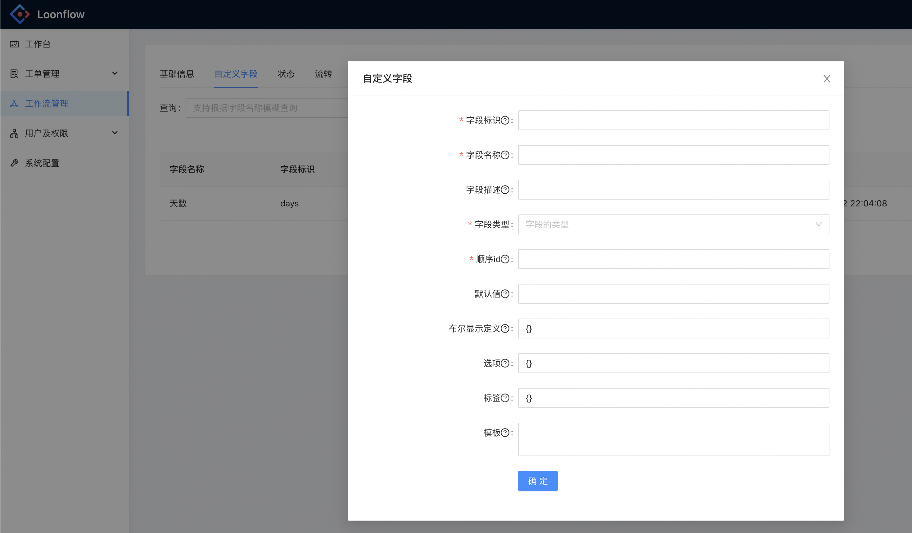
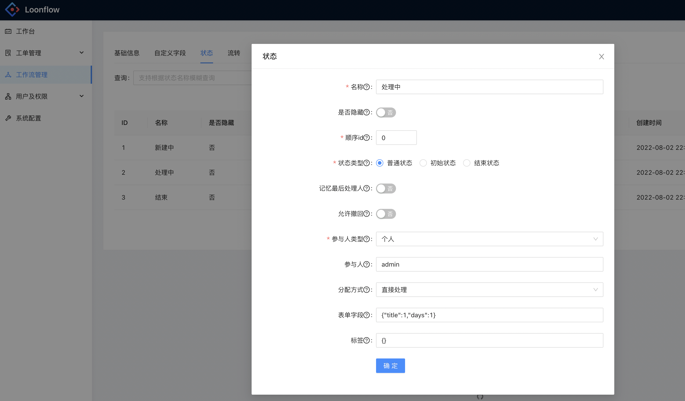
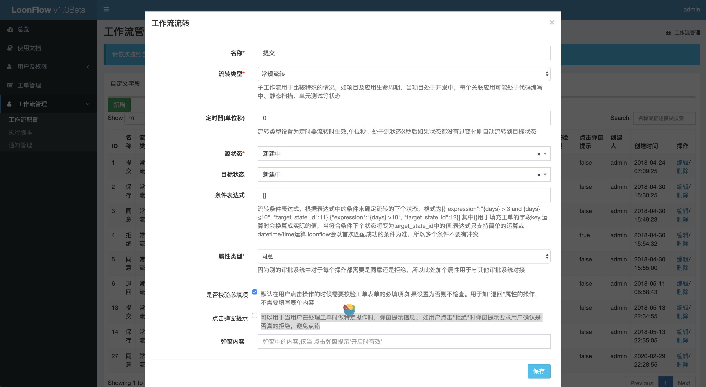

==========
工作流配置
==========

----------
自定义通知
----------
自定义通知的管理权限仅限loonflow管理员，即用户表中is_admin为true的用户。通知hook添加后，工作流管理员在配置工作流时可以选择这些通知。
其中hook_url为提供通知服务的地址，token作为计算签名的密钥，当工作流选择了通知，那么通过此工作流创建的工单状态发送变化时都会触发hook。
loonflow将会对这个hook_url发送一个post请求，请求头中包括签名，计算方式方式同loonflow校验api请求的签名算法。请求内容中包括工单最新
的处理人信息，被请求方可以根据这个处理人信息发送通知消息。hook服务方建议校验请求头中的签名后再响应请求。

签名算法

::

  def gen_signature_by_token(cls, token: str)->tuple:
    md5_key = token
    timestamp = str(int(time.time()))
    ori_str = timestamp + md5_key
    tar_str = hashlib.md5(ori_str.encode(encoding='utf-8')).hexdigest()
    return True, dict(signature=tar_str, timestamp=timestamp)

loonflow发送hook请求时，header头中将包含signature 和timestamp。

请求内容中将包含以下参数

::

  {
    'title_result': title_result, # 通知标题，在工作流配置中会配置标题模板，此处将根据工单的信息生成实际的标题
    'content_result': content_result, # 通知内容，在工作流配置中会配置内容模板，此处将根据工单的信息生成实际的内容
    'participant_type_id': ticket_obj.participant_type_id, # 当前参与人类型, 类型定义见文档中"常量说明", hook服务方需根据类型决定是否发送消息
    'ticket_value_info': ticket_value_info,  # 该字段中将包含工单所有字段的值，一般情况下发送消息时候根据标题和内容发送即可，
    'last_flow_log': last_flow_log,  # 工单的最近一条处理记录，发送通知消息时可以根据自己需要决定消息中是否包含这个信息
    'participant_info_list': participant_info_list  # 工单的当前处理人信息列表， 是一个数组，每个记录中都包含处理人的username, alias, email, phone
   }

新建自定义通知

 .. figure:: ../images/hook_notice.png

----------
工作流
----------

创建一个工作流包括四个部分，创建工作流基础信息、添加工作流的自定义字段、添加状态、添加流转。 在创建和编辑工作流时可以指定对应的管理员，
只有工作流对应的管理员、工作流创建人、loonflow超级管理员才有工作流的编辑权限。拥有工作流管理员权限的用户可以新增和维护自己相关
(自己创建的、作为管理员的)的工作流

选择通知：loonflow超级管理员在通知管理中添加通知后，工作流管理员即可在新建或编辑工作流时候选择这些通知。

工单查看权限校验：开启后，以工单的关联人(创建人、曾经的处理人)的名义调用工单详情接口才可以返回详情信息

限制表达式：默认"{}"，限制周期({"period":24} 24小时), 限制次数({"count":1}在限制周期内只允许提交1次), 限制级别({"level":1} 
针对(1单个用户 2全局)限制周期限制次数,默认特定用户);允许特定人员提交({"allow_persons":"zhangsan,lisi"}只允许张三提交工单,
{"allow_depts":"1,2"}只允许部门id为1和2的用户提交工单，{"allow_roles":"1,2"}只允许角色id为1和2的用户提交工单)。符合限制
表达式规则时调用创建工单接口会返回code=-1,同时msg中将有相应的说明

标题模板：用于发送通知时，确定通知的标题

内容模板：用于发送通知，确定通知的内容

管理员： 工作流的创建人和这里的管理员有权限修改配置此工作流， 另外loonflow的超级管理员拥有对所有工作流的配置查看权限

 .. figure:: ../images/new_workflow.png

 -------------
 自定义字段
 -------------

每个类型的工作流有各自不同的字段， 通过自定义字段可以为工作流新增独有的字段

字段标识：自定义字段需要有个标识，需要为英文字母+下划线，如reason、problem_description

字段名称：自定义字段的名称，如请假理由、问题描述等

字段类型：支持字符串、整形、浮点型、布尔、日期、日期时间、单选框、多选框、下拉列表、多选下拉列表、文本域、用户名、多选用户名、附件。
其中单选、多选、下拉、多选下拉默认支持给定可选范围的情况，如果你需要可选项通过接口获取，请使用字符串类型，然后在”标签“中填写前后端约定好的信息。
由前端针对这个字段特殊处理。附件类型需要调用方自己处理上传逻辑后将附件路径随其他字段一起提交，loonflow只保存附件路径。关于用户名类型字段，
调用方前端可以显示一个搜索用户的可选框，然后提交被选择的username或者逗号隔开的多个被选择username(多选用户名类型)。

顺序ID：用于指定工单详情界面中字段的布局顺序，调用方前端需要根据这个id来布局字段

默认值：调用方前端当用户未填写内容时，可以根据这个信息给定默认值显示

布尔显示定义：当字段类型是布尔类型时，可以通过定义来显示不同的文字，如{"1":"是","0":"否"}或{"1":"需要","0":"不需要"}，注意数字也需要引号

选项：用于指定单选、多选、下拉框、多选下拉框字段的可选项目，格式为json如:{"1":"中国", "2":"美国"},{"ch":"中国", "us":"美国"}注意数字也需要引号

标签：用于特殊字段，通过与调用方约定标签内容，可以实现任意的字段表现形式，格式为json,如{"table":"http://xxx.com/table"}
可以表示从http://xxx.com/table 获取信息，然后显示为一个表格

模板： 用于文本域类型字段前端根据此模板显示默认值

------
状态
------

工单会存在各种状态，工单的处理过程也就是工单的状态的变化，loonflow对于工作流的状态支持各种灵活的配置

名称： 状态的名称，如创建中、编辑中、tl审批中、结束等等

是否隐藏： 开启后，获取工单步骤接口将不返回此状态(工单当前处于隐藏状态除外)。因为step图是线性的，
而loonflow工作流状态是支持环状关联的，所以在step图需要将一些旁支状态隐藏掉

顺序id： 用于指定“获取工单步骤”接口中返回的状态id，因为step图是线性的，
而loonflow工作流状态是支持环状关联的，所以在step图显示时需要给定每个状态的显示顺序

状态类型： 状态分为三个状态，初始状态、普通状态、结束状态，一个工作必须包含一个初始状态、一个结束状态、0-N个普通状态，
初始状态用于创建工单时根据这个状态及状态关联的流转来确定可以做的提交操作(提交、新建、保存等等)。结束状态表示工单到此状态后
将无法被继续处理，建议只设置一个结束状态，否则 “强制关闭工单”接口将无法正常关闭工单(无法确定结束状态是哪个)

是否记忆最后处理人： 开启后，到达此状态时会先检查之前是否有人在此状态处理过，如果有则处理人为最后一次处理的人，
使用场景如：运维处理中状态下处理人有A、B、C，其中A处理了工单，然后到达发起人确认状态时，发起人发现处理的有问题，
那么发起人可能是希望将工单退回到之前处理的A。而不是A、B、C都收到工单

参与人类型： 参与人类型包括个人、多人、部门、角色、工单字段、父工单字段、hook、外部获取、无。
注意：如果需要在此状态创建子工单，需要将参与人类型设置为个人，参与人使用loonrobot

参与人：参与人信息根据参与人类型不同而不同，如果参与人类型是个人，那么参与人需要填写用户的username。 如果参与人类型是多人，
那么参与人需要填写多个username,用逗号隔开，如zhansan,lisi。如果参与人类型是部门，则参与人填写loonflow部门记录中的部门id(需要多个部门处理时，
逗号隔开部门的id，如1,3)。如果参与人类型是角色，则参与人填写loonflow角色记录中的id.如果参与人类型是脚本（建议使用hook方式替代），
则填写“工作流配置”-“执行脚本”中的脚本id。如果参与人类型是工单字段，则参与人填写工作流基础字段或者此工作流定义的自定义字段的字段标识
如username, agent。如果参与人类型是父工单字段，则填写工单的对应字段的标识。如果参会人类型填写无，那么处理人信息留空。
如果参与人类型是hook，那么参与人填写{"hook_url":"http://xxx.com/xxx", "hook_token":"xxxx", "wait":true, "extra_info":"xxx"}，
其中hook_url是要触发hook的目标地址，hook_token用于签名计算,你的hook服务端需要保存此hook_token，hook签名算法如下方代码区,
触发hook请求时候会将timestamp和signature添加到请求头中，hook服务端应该在收到请求后按照相同的签名算法先校验签名的有效性然后才响应hook请求。
wait的值可以是true或者false,如果wait的值是false那么工单触发hook成功(hook服务端返回json类型数据，其中code=0)后直接进入新的状态(触发失败的话
即code=-1 或者服务端无响应或者http status非200工单会标记script_run_last_result为False，你可以调用“重试工单脚本/任务”重新触发hook)，
如果wait的值是true那么工单触发hook后会停留在当前状态，直到hook方回调(回调逻辑见文档中“工单相关接口”-"工单hook回调")loonflow成功
(请求参数中result=True)后工单的状态才继续流转。extra_info(非必填)可以用于传一些额外的信息，loonflow会将这个信息连同工单信息传给hook服务端。
如果参与人类型是'外部获取'，参与人信息需要填写{"external_url":"http://www.xx.com", "external_token":"xxx", "extra_info":""}，
系统将根据你配置的地址发起post请求，将结果中的内容作为参与人。

::

  import time
  timestamp = str(time.time())[:10]
  ori_str = timestamp + token
  signature = hashlib.md5(ori_str.encode(encoding='utf-8')).hexdigest()

hook触发时loonflow向hook_url服务端post请求时带的数据如下(外部获取类型post请求数据格式也如此)：

::

  {
    "id":11,
    "sn":"loonflow202002020001",
    "title":"xxx",
    "state_id":1,
    ...., //等等工单的所有字段的值
    "extra_info": "xxxx", // 此处如果你配置hook的时候指定了extra_info那么会有这个字段，如果没配置就没这个信息
  }

对于hook类型你的hook服务端需要response status code 200， 内容为json格式,包含code,msg字段，code为0 表示hook服务端已成功收到请求，并正常处理。
如{"code":200, "msg":"ok"}，其中msg会被记录到工单的flowlog中,你可以在你处理出错时将出错原因填充到msg字段。
对于外部获取类型，你的external_url的服务端需要response status code 200,内容为json格式，包含code,msg, data字段，如{"code":0, "msg":"xxx",
"data":"zhansgan,lisi"}， 其中data字段中包含的是你需要将此工单的处理人设置为哪些username, 多个username使用逗号隔开

分配方式： 分配方式包括直接处理、主动接单、随机分配、全部处理。如果设置为直接处理，工单的当前处理人可以直接点击配置的流
转(如同意、拒绝、完成)来处理。如果设置为主动接单，则当前处理人需要先接单，然后才可以按照配置的流转来处理(表现形式为获取用
户可执行的操作接口只会返回接单这个流转，具体参考关于接单接口的纤细描述)。 如果设置为随机分配，那么系统会自动将工单处理人设置
为有处理权限的人之间的一个，只有这个人可以处理。如果设置为全部处理，则需要此状态的所有参与人都处理完且处理操作一致，才会改变
工单的状态。

表单字段： 状态的表单字段用于定义当用户有对该工单处理权限时，当前状态工单详情中应该显示哪些字段以及这些字段是否可编辑。其中
1表示只读，2表示必填，3表示可选，示例：{"gmt_created":1,"title":2, "sn":1}, 内置特殊字段
participant_info.participant_name:当前处理人信息(部门名称、角色名称)，state.state_name:当前状态的状态名,
workflow.workflow_name:工作流名称，

状态标签：json格式，可以使用此配置实现不同状态各种定制化需求，如在服务器申请工单的tl审批阶段显示发起人拥有的所有服务器权限列表，
那么状态标签可以设置为{"display_server":1}，标签具体内容与调用方约定好即可，

-------
流转
-------
流转用于定义每个状态之间的变化途径。

名称：定义流转的名称，表现为工单详情中用户可以点击的操作，如“提交”、“保存”、“同意”、“拒绝”、“完成”、“关闭”等等

流转类型：流转类型包括常规流转和定时器流转。如果选择定时器流转，需要设定定时器的时间。

定时器：单位是秒，如果流转配置了定时器，当工单处于这个流转的源状态停留对应定时器的时间后未做任何操作，那么定时器会触发工单自动流转到下个状态。
使用场景如：客服类工单超过SLA无人处理，自动流转到客服团队leader处理

源状态：流转的源状态，即这个流转是在某个状态下可以执行

目标状态：触发流转后工单的状态将改变为这个目标状态。当流转类型为条件流转时，这里的目标状态将无效，以条件表达式中设定的条件目标状态来流转

条件表达式：流转条件表达式，根据表达式中的条件来确定流转的下个状态，格式为[{"expression":"{days} > 3 and {days} ≤10", 
"target_state_id":11},{"expression":"{days} >10", "target_state_id":12}] 其中{}用于填充工单的字段key,
运算时会换算成实际的值，当符合条件下个状态将变为target_state_id中的值,表达式只支持简单的运算或datetime/time运算.
loonflow会以首次匹配成功的条件为准，所以多个条件不要有冲突

属性类型：因为别的审批系统中对于每个操作可能只有同意还是拒绝，所以此处加个属性用于与其他审批系统对接，另外也根据根据这个属性来判断工单是否被拒绝
(工单列表查询支持是否被拒绝这个条件)

是否校验必填项: 默认在用户点击操作的时候需要校验工单表单的必填项,如果设置为否则不检查。用于如"退回"属性的操作，不需要填写表单内容

点击弹窗提示： 可以用于当用户在处理工单时做特定操作时，弹窗提示信息。 如用户点击"拒绝"时弹窗提示要求用户确认是否真的拒绝，避免点错

弹窗内容: 当启用”点击弹窗提示“时可以设置弹窗中的内容

