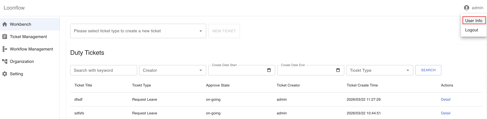
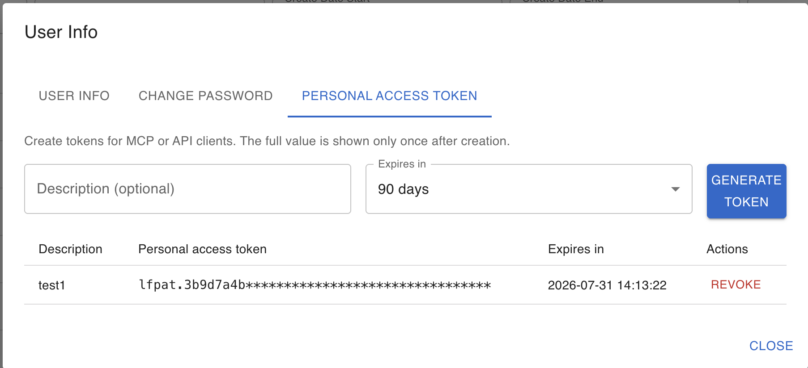

Model Context Protocol (MCP) — Ticket Server
==============================================

Overview
--------

Loonflow exposes a **Model Context Protocol** server that lets compatible clients (for example AI-assisted editors) query and handle tickets through authenticated tools. The server name advertised to clients is ``loonflow-ticket``. Tools call the same permission-aware ticket services as the web UI.

Authentication
--------------

Calls must be authenticated with an **access token**. Supported token types include:

- **Personal access token** (recommended for MCP clients): values start with ``lfpat.``
- **JWT** issued by Loonflow (same as API usage)

You can pass the token in the MCP HTTP client as a header (see configuration below), pass it per tool where supported, or configure a server-side environment variable for non-interactive setups.

Create a personal access token
------------------------------

Open **Personal Information** in the product UI, then open **Personal Access Token**. Create a new token and store it securely. Replace ``xxx`` in the configuration example with that token.

   Navigate to Personal Information → Personal Access Token.

   Create or manage personal access tokens.

Client configuration (example)
------------------------------

Use the Streamable HTTP endpoint exposed by the MCP process (default path ``/mcp``). Adjust host and port to match your deployment; local development often uses port ``8002``.

For the Loonflow SaaS service, use ``https://mcp.loonflow.com/mcp`` as the MCP server URL.

.. code-block:: json

   {
     "mcpServers": {
       "loonflow-ticket": {
         "url": "http://127.0.0.1:8002/mcp",
         "headers": {
           "Authorization": "Bearer xxx"
         }
       }
     }
   }

Replace ``xxx`` with your **personal access token**. If the client supports separate auth configuration, you may alternatively send ``X-Loonflow-Access-Token`` with the raw token value.

Supported tools
---------------

The server currently registers the following tools.

``ticket_list``
~~~~~~~~~~~~~~~

Returns a **paginated ticket list** for the authenticated user, including total count and pagination metadata.

**Main behavior:**

- **category** selects which list to query: ``duty`` (my todo), ``owner`` (created by me), ``relation`` (related to me), ``view`` (I can view), ``worked`` (tickets I processed), ``intervene`` (I can intervene), ``all`` (all tickets; **admin only**).
- Optional filters include free-text **search_value**, **create_start** / **create_end**, **workflow_ids**, **node_ids**, **ticket_ids**, **act_state**, **creator_id**, **parent_ticket_id**, **reverse**, **per_page**, and **page**.
- If neither ``create_start`` nor ``create_end`` is set, a default time window is applied (see server implementation).

``ticket_detail``
~~~~~~~~~~~~~~~~~

Loads **ticket detail** for a given ``ticket_id``: dynamic form schema (**component_info_list**), workflow metadata, **field_permissions**, derived **required_fields** / **optional_fields** / **readonly_fields**, and available **actions** (plus **admin_actions** when applicable), including base node identifiers used by some actions.

``ticket_prepare_handle``
~~~~~~~~~~~~~~~~~~~~~~~~~

Prepares the **same context as ticket detail** (form schema, permissions, and available actions). Use it when you want a dedicated “prepare to handle” step before submitting an action.

``ticket_handle``
~~~~~~~~~~~~~~~~~

**Executes a workflow action** on a ticket after permission and field validation.

**Main behavior:**

- **action_type** and **action_id** must match one of the actions returned for the current user (including admin actions when allowed).
- **fields** must satisfy **required** fields for the current node/form.
- **action_props** carries extra properties required by specific actions (for example node context for comments when applicable).
- **dry_run**: when ``true``, validates the request and returns a summary **without** changing the ticket; when ``false``, performs the handle operation.

Operational notes
-----------------

- Default listen address and port are controlled by environment variables (for example ``LOONFLOW_MCP_HOST``, ``LOONFLOW_MCP_PORT``); align your client URL with the running process.
- For server-side default authentication (for example stdio transports), refer to ``LOONFLOW_MCP_ACCESS_TOKEN`` in the MCP server documentation in the codebase.
