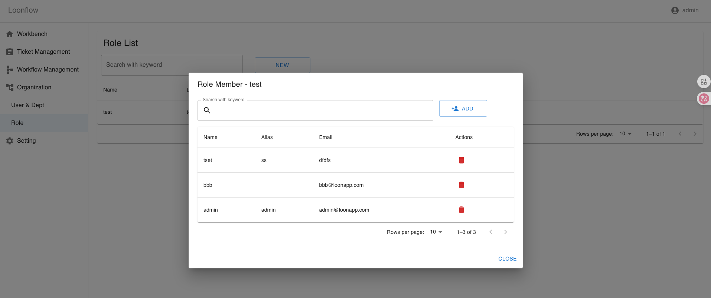

Role Management
==================

Loonflow supports managing roles so you can create, edit, delete, and maintain role members. Roles are primarily used when configuring workflows to specify handlers, allowing you to assign a role as the processor for a workflow node.

