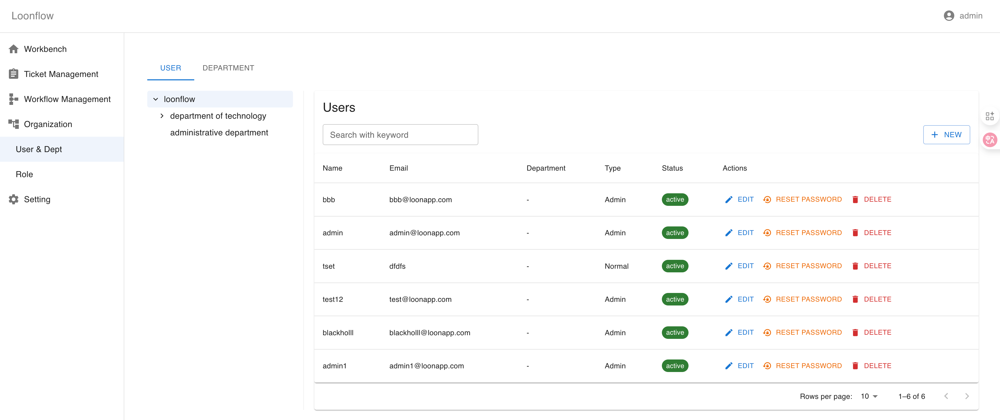

User and Department Management
==============================

Loonflow provides built-in user and department management. You can add, edit, and delete users or departments in the UI, and you can also synchronize them in bulk through the API.

How to manage
-------------
- UI maintenance: manually create or adjust users and departments on the “Organization Management” page—best for small-scale or ad-hoc changes.
- API sync: call the organization management APIs to maintain users and departments in bulk. Populate the ``label`` field with an external system’s unique identifier (e.g., LDAP, AD) to simplify mapping and reconciliation later.

Coming soon
-----------
Support for Azure AD, Google, DingTalk, and WeCom (WeChat Work) OAuth logins is on the way. After enabling, users and departments can be pulled from external identity sources without manual upkeep in the UI.
