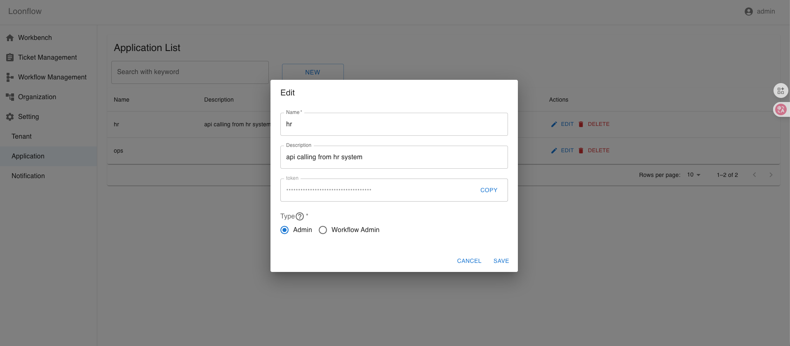

Application Management
======================

Applications are used to authenticate API calls. After creating an application, a token is generated and should be used to sign each request. The signing algorithm is documented in the Postman collection: https://documenter.getpostman.com/view/15031929/2sB3WyJbap

Application types
-------------------
- admin: Administrators can call all APIs.
- workflow_admin: Workflow administrators can call workflow/ticket APIs and common APIs.
