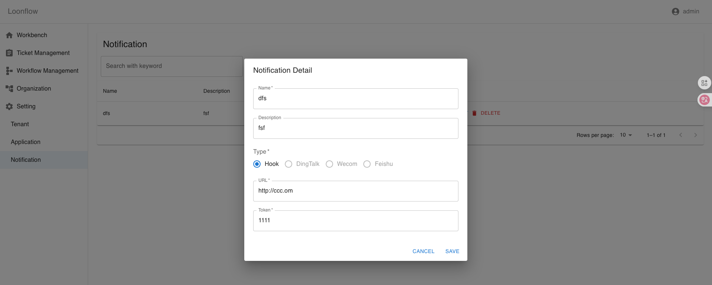

Notification Management
=========================

Loonflow lets you add, edit, and delete notifications. Multiple delivery
channels are available so you can wire notifications into your own systems.

Notification Types
-------------------

- hook: Triggers a POST request to your notification endpoint with the current
  ticket data in request body. The token is used for signing, following the same
  approach as application tokens.
- teams (planned): Sends to a Teams bot.
- email (planned): Sends email; requires mail server configuration.
- dingtalk (planned): Sends via DingTalk bot.
- wecom (planned): Sends via WeCom bot.
- feishu (planned): Sends via Feishu bot.
